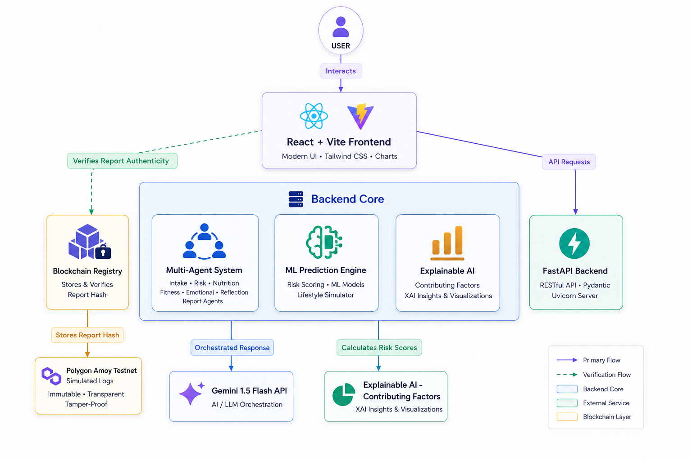

# HerChain AI 🌸

[](https://vitejs.dev/)
[](https://fastapi.tiangolo.com/)
[](https://blockchain.com/)
[](https://tailwindcss.com/)

**HerChain AI** is a premium, AI-powered women's healthcare platform designed to provide stage-specific wellness insights, secure medical data verification via blockchain technology, and an advanced multi-agentic conversational health assistant.

---

## 🗺️ System Architecture

<p align="center">
  
</p>

---

## ✨ Core Features Explained

### 🤖 Multi-Agent AI Health Assistant
The application uses a specialized multi-agent architecture to process symptoms and output structured wellness summaries. When the user interacts in the chat:
1. **Intake Agent**: Parses input query and builds structured symptom context.
2. **Risk Agent**: Computes preliminary clinical risks based on medical profiles.
3. **Nutrition Agent**: Generates tailored nutrition advice based on profile details.
4. **Fitness Agent**: Designs lifestyle exercises tailored to the specific life stage.
5. **Emotional Agent**: Validates stress markers and mental wellness indicators.
6. **Reflection Agent**: Critiques output for clinical consistency, avoiding exaggerations.
7. **Report Agent**: Consolidates final Markdown report with structured observations.

### 📊 Machine Learning Predictions & Explainable AI (XAI)
HerChain AI features custom ML risk-assessment scoring that targets:
* **Obesity**: Analyzes BMI combined with physical activity penalties.
* **Gestational Diabetes Mellitus (GDM)**: Considers age factors, pregnancy weeks, glucose history, and family background.
* **Type 2 Diabetes (T2D)**: Tracks sleep duration, stress levels, glucose measurements, and BMI.
* **Hormonal & Cardiovascular Health**: Gauges markers dynamically based on menopause status, stress, and lifestyle frequency.
* **Explainable AI (XAI)**: Identifies the exact mathematical weight of contributing factors (e.g., BMI, sleep quality, stress levels) and presents them visually.
* **Lifestyle Simulator**: Users can adjust a slider to see how simulated lifestyle improvements (e.g., increasing activity levels) directly reduce their predicted health risk score.

### 🔗 Blockchain Verification Layer
To guarantee the integrity and tamper-proof nature of sensitive health records:
* **Report Hashing**: Completed AI health summaries are hashed using SHA-256.
* **Polygon Registration**: The hash is logged onto a simulated smart contract registry on the **Polygon Amoy Testnet** (simulating `storeReportHash`).
* **Verifiable Verification**: Third parties or users can upload/input a report hash to verify its authenticity, timestamp, block number, and contract address directly through the UI.

---

## 🛠️ Tech Stack

### Frontend
* **Core**: React 18 with TypeScript
* **Build Tool**: Vite
* **Styling**: Tailwind CSS & Vanilla CSS (Vibrant HSL palettes, glassmorphism, dynamic gradients, smooth micro-animations)
* **Visualizations**: Recharts (for health metrics & risk breakdown)
* **Animation**: Framer Motion

### Backend
* **Core Framework**: FastAPI (Python 3.10+)
* **AI Integration**: Google GenAI SDK (Gemini 1.5 Flash)
* **Libraries**: `pydantic` (Schema validation), `numpy`, `pandas`, `scikit-learn` (ML calculation engines), `uvicorn` (ASGI Server)

---

## 📂 Project Structure

```text
Herchain_AI/
├── backend/                  # FastAPI Application
│   ├── api/
│   │   ├── routes/
│   │   │   ├── agents.py       # Multi-Agent orchestrator & system prompts
│   │   │   ├── blockchain.py   # Polygon registry simulation & contract info
│   │   │   ├── health.py       # Health check endpoints
│   │   │   └── predictions.py  # ML risk engines & lifestyle simulator
│   │   └── schemas.py          # Unified Pydantic request/response schemas
│   ├── blockchain/           # Smart contract configurations
│   ├── .env                  # Configuration variables (Host, Port, API Key)
│   ├── main.py               # Application entry point
│   └── requirements.txt      # Backend dependencies
│
├── frontend/                 # React Vite Application
│   ├── src/
│   │   ├── components/       # Reusable layout and widget components
│   │   ├── pages/            # View pages (Landing, Onboarding, Dashboard, Chat, Blockchain)
│   │   ├── lib/              # Client utility functions
│   │   ├── App.tsx           # Router and page orchestrator
│   │   └── index.css         # Tailwind directives and custom animation classes
│   └── package.json          # Node dependencies and scripts
└── README.md                 # Primary project documentation
```

---

## 🚀 Getting Started

### Prerequisites
* **Node.js** (v18+)
* **Python** (v3.9+)

### Installation & Run Instructions

#### 1. Setup Backend
```bash
cd backend
python -m venv venv

# Activate Virtual Environment:
# On Windows (CMD/PowerShell):
.\venv\Scripts\activate
# On macOS/Linux:
source venv/bin/activate

pip install -r requirements.txt
python -m uvicorn main:app --reload --host 127.0.0.1 --port 8000
```
*The backend API documentation is now viewable at http://127.0.0.1:8000/docs.*

#### 2. Setup Frontend
Open a new terminal session in the project root:
```bash
cd frontend
npm install
npm run dev
```
*The frontend application is now active at http://localhost:5173.*

---

## 🔌 API Reference

### AI Agents Endpoints
* **`GET /api/agents/list`** - Retrieves configured agents with their goals and roles.
* **`POST /api/agents/chat`** - Processes user messages and profile parameters using the Gemini Agent pipeline.
  * *Request Body:* `ChatRequest` containing `message` and `user_profile`.

### ML Prediction Endpoints
* **`POST /api/predictions/predict`** - Predicts multi-dimensional risk scores from a health parameter snapshot.
* **`POST /api/predictions/simulate`** - Evaluates risk reduction based on target lifestyle improvements.

### Blockchain Verification Endpoints
* **`POST /api/blockchain/store`** - Registers a report's SHA-256 hash on the simulated ledger.
* **`POST /api/blockchain/verify`** - Verifies if a given hash exists on the block registry.
* **`GET /api/blockchain/records`** - Lists all current records on the ledger.
* **`GET /api/blockchain/contract`** - Returns contract details (methods, Solidity compiler parameters, network configuration).

---

## 🛡️ Security & Privacy
We prioritize user data protection.
1. **Zero Data Retention**: The system evaluates input health variables in-memory; sensitive reports are only stored client-side.
2. **De-identified Ledger**: Only the cryptographic hash (SHA-256) of the report is stored on the public blockchain, ensuring no Personally Identifiable Information (PII) is exposed.
3. **Clinical Guardrails**: System prompt restrictions ensure that agents will never provide hazardous diagnoses and will always suggest professional consultation when high-risk flags are triggered.

---
Built for women's wellness by the HerChain AI Team.
